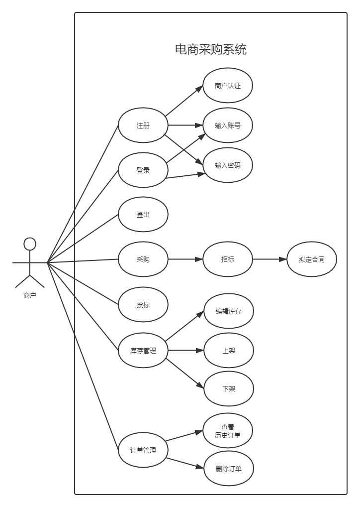
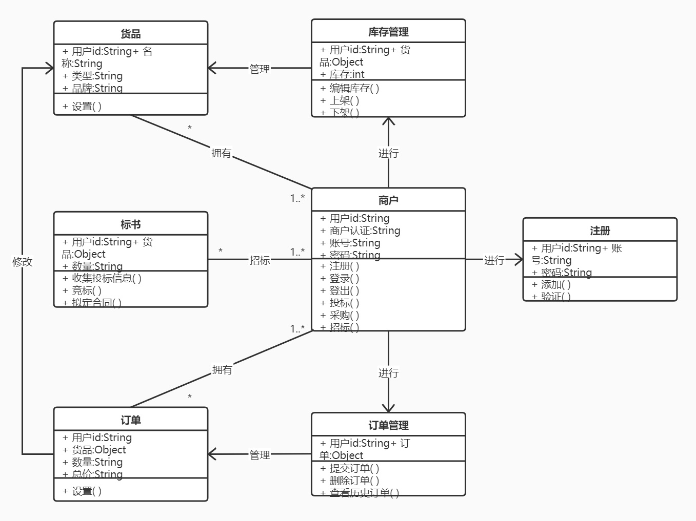

# 电商采购系统

## 绪论

### 题目背景及目的

### 关键技术简介

### 平台环境及工具

#### 操作系统
* Windows版本：Windows 10 x64
* 处理器：Intel(R) Core(TM) i5-7300HQ CPU @ 2.50GHz(4 CPUs)
* 内存：8192MB RAM
* 硬盘：256G SSD
#### 编程工具
IDEA
#### 服务器
Node.js
#### 数据库
* MongoDB
* Mongoose
#### 其他工具
* 打包工具：webpack
* 接口测试工具：Postman
* 版本控制工具：Git
* 项目脚手架：create-react-app

## 需求分析

### 功能需求分析

#### 用例图
 

#### 用例表
<table>
 <tr>
  <td>用例编号</td>
  <td>01</td>
 </tr>
 <tr>
  <td>用例名</td>
  <td>注册</td>
 </tr>
 <tr>
  <td>用例描述</td>
  <td>商户点击注册按钮，通过商户认证，填写账号及密码完成平台注册</td>
 </tr>
 <tr>
  <td>参与者</td>
  <td>商户</td>
 </tr>
 <tr>
  <td>前置条件</td>
  <td>商户未注册</td>
 </tr>
 <tr>
  <td>后置条件</td>
  <td>注册成功跳转到登录界面</td>
 </tr>
 <tr>
  <td>主事件流</td>
  <td><ol>
   <li>输入商户名进行商户认证</li>
   <li>输入账号</li>
   <li>输入密码两次</li>
   <li>点击注册按钮，商户及账号信息录入后台并保存</li>
   <li>注册成功，跳转到登录页面</li>
  </ol></td>
 </tr>
 <tr>
  <td>备选事件流</td>
  <td><ol>
   <li>网络异常</li>
   <li>传递参数错误</li>
   <li>账号已存在</li>
   <li>输入为空</li>
   <li>前后输入的密码不一致</li>
  </ol></td>
 </tr>
</table>
 
<table>
 <tr>
  <td>用例编号</td>
  <td>02</td>
 </tr>
 <tr>
  <td>用例名</td>
  <td>登录</td>
 </tr>
 <tr>
  <td>用例描述</td>
  <td>商户于登录界面输入账号及密码经后台校验成功后登入系统</td>
 </tr>
 <tr>
  <td>参与者</td>
  <td>商户</td>
 </tr>
 <tr>
  <td>前置条件</td>
  <td>商户已存在且账号密码对应正确</td>
 </tr>
 <tr>
  <td>后置条件</td>
  <td>登入系统并跳转到系统使用界面</td>
 </tr>
 <tr>
  <td>主事件流</td>
  <td><ol>
   <li>输入账号</li>
   <li>输入密码</li>
   <li>点击登录按钮</li>
   <li>账号密码作为参数提交到服务器端进行校验</li>
   <li>校验正确并跳转向系统使用界面</li>
  </ol></td>
 </tr>
 <tr>
  <td>备选事件流</td>
  <td><ol>
   <li>网络异常</li>
   <li>传递参数错误</li>
   <li>账号不存在</li>
   <li>密码错误</li>
  </ol></td>
 </tr>
</table>
 
<table>
 <tr>
  <td>用例编号</td>
  <td>03</td>
 </tr>
 <tr>
  <td>用例名</td>
  <td>登出</td>
 </tr>
 <tr>
  <td>用例描述</td>
  <td>商户于系统使用界面点击登出按钮退出登录状态</td>
 </tr>
 <tr>
  <td>参与者</td>
  <td>商户</td>
 </tr>
 <tr>
  <td>前置条件</td>
  <td>商户处于系统使用界面</td>
 </tr>
 <tr>
  <td>后置条件</td>
  <td>登出系统并跳转向登录界面</td>
 </tr>
 <tr>
  <td>主事件流</td>
  <td><ol>
   <li>商户点击登出按钮</li>
   <li>账号登出请求被提交到服务器端，经处理后与服务器断开</li>
   <li>界面重定向到登录界面</li>
  </ol></td>
 </tr>
 <tr>
  <td>备选事件流</td>
  <td><ol>
   <li>网络异常</li>
   <li>传递参数错误</li>
  </ol></td>
 </tr>
</table>
 
<table>
 <tr>
  <td>用例编号</td>
  <td>04</td>
 </tr>
 <tr>
  <td>用例名</td>
  <td>采购</td>
 </tr>
 <tr>
  <td>用例描述</td>
  <td>商户进入采购界面通过检索词条进行采购</td>
 </tr>
 <tr>
  <td>参与者</td>
  <td>商户</td>
 </tr>
 <tr>
  <td>前置条件</td>
  <td>商户已登录</td>
 </tr>
 <tr>
  <td>后置条件</td>
  <td>根据词条内容将刷新采购界面更新供应内容</td>
 </tr>
 <tr>
  <td>主事件流</td>
  <td><ol>
   <li>商户点击采购按钮进入采购界面</li>
   <li>商户输入检索词条点击检索</li>
   <li>检索请求被提交到服务器端，服务器端根据请求返回相应的供应内容</li>
   <li>商户挑选合适内容完成采购，并由系统生成订单</li>
  </ol></td>
 </tr>
 <tr>
  <td>备选事件流</td>
  <td><ol>
   <li>网络异常</li>
   <li>传递参数错误</li>
   <li>商户不满意供应内容，自行发起招标</li>
   <li>订单生成异常</li>
  </ol></td>
 </tr>
</table>
 
<table>
 <tr>
  <td>用例编号</td>
  <td>05</td>
 </tr>
 <tr>
  <td>用例名</td>
  <td>投标</td>
 </tr>
 <tr>
  <td>用例描述</td>
  <td>商户进入投标界面通过检索词条选择性投标</td>
 </tr>
 <tr>
  <td>参与者</td>
  <td>商户</td>
 </tr>
 <tr>
  <td>前置条件</td>
  <td>商户已登录</td>
 </tr>
 <tr>
  <td>后置条件</td>
  <td>根据词条内容将刷新投标界面更新招标内容</td>
 </tr>
 <tr>
  <td>主事件流</td>
  <td><ol>
   <li>商户点击投标按钮进入投标界面</li>
   <li>商户输入检索词条点击检索</li>
   <li>检索请求被提交到服务器端，服务器端根据请求返回相应的招标内容</li>
   <li>商户挑选合适内容投标，进行竞标</li>
   <li>竞标成功后与招标商户拟定电子合同</li>
  </ol></td>
 </tr>
 <tr>
  <td>备选事件流</td>
  <td><ol>
   <li>网络异常</li>
   <li>传递参数错误</li>
   <li>电子合同生成异常</li>
  </ol></td>
 </tr>
</table>
 
<table>
 <tr>
  <td>用例编号</td>
  <td>06</td>
 </tr>
 <tr>
  <td>用例名</td>
  <td>库存管理</td>
 </tr>
 <tr>
  <td>用例描述</td>
  <td>商户点击库存管理跳转到库存管理界面</td>
 </tr>
 <tr>
  <td>参与者</td>
  <td>商户</td>
 </tr>
 <tr>
  <td>前置条件</td>
  <td>商户已登录</td>
 </tr>
 <tr>
  <td>后置条件</td>
  <td>显示库存及库存管理操作</td>
 </tr>
 <tr>
  <td>主事件流</td>
  <td><ol>
   <li>商户点击库存管理按钮进入库存管理界面</li>
   <li>库存显示请求被提交到服务器端，服务器端根据请求返回库存内容</li>
  </ol></td>
 </tr>
 <tr>
  <td>备选事件流</td>
  <td><ol>
   <li>网络异常</li>
   <li>传递参数错误</li>
   <li>库存显示异常</li>
  </ol></td>
 </tr>
</table>
 
<table>
 <tr>
  <td>用例编号</td>
  <td>07</td>
 </tr>
 <tr>
  <td>用例名</td>
  <td>订单管理</td>
 </tr>
 <tr>
  <td>用例描述</td>
  <td>商户点击订单管理跳转到订单管理界面</td>
 </tr>
 <tr>
  <td>参与者</td>
  <td>商户</td>
 </tr>
 <tr>
  <td>前置条件</td>
  <td>商户已登录</td>
 </tr>
 <tr>
  <td>后置条件</td>
  <td>显示当前未完成订单及订单管理操作</td>
 </tr>
 <tr>
  <td>主事件流</td>
  <td><ol>
   <li>商户点击订单管理按钮进入订单管理界面</li>
   <li>订单显示请求被提交到服务器端，服务器端根据请求返回订单内容</li>
  </ol></td>
 </tr>
 <tr>
  <td>备选事件流</td>
  <td><ol>
   <li>网络异常</li>
   <li>传递参数错误</li>
   <li>订单显示异常</li>
  </ol></td>
 </tr>
</table>
 
<table>
 <tr>
  <td>用例编号</td>
  <td>08</td>
 </tr>
 <tr>
  <td>用例名</td>
  <td>编辑库存</td>
 </tr>
 <tr>
  <td>用例描述</td>
  <td>商户于库存管理界面点击编辑库存按钮进行库存编辑</td>
 </tr>
 <tr>
  <td>参与者</td>
  <td>商户</td>
 </tr>
 <tr>
  <td>前置条件</td>
  <td>商户处于库存管理界面</td>
 </tr>
 <tr>
  <td>后置条件</td>
  <td>未上架库存可上架，已上架库存可下架</td>
 </tr>
 <tr>
  <td>主事件流</td>
  <td><ol>
   <li>商户点击编辑库存按钮进行库存编辑模式</li>
   <li>商户编辑库存表格</li>   
   <li>库存修改被提交到服务器端，服务器根据修改请求更新商户库存并反馈成功信息</li>
  </ol></td>
 </tr>
 <tr>
  <td>备选事件流</td>
  <td><ol>
   <li>网络异常</li>
   <li>传递参数错误</li>
   <li>库存编辑异常</li>
   <li>库存更新异常</li>
  </ol></td>
 </tr>
</table>
 
<table>
 <tr>
  <td>用例编号</td>
  <td>09</td>
 </tr>
 <tr>
  <td>用例名</td>
  <td>查看历史订单</td>
 </tr>
 <tr>
  <td>用例描述</td>
  <td>商户点击查看历史订单按钮查看历史订单</td>
 </tr>
 <tr>
  <td>参与者</td>
  <td>商户</td>
 </tr>
 <tr>
  <td>前置条件</td>
  <td>商户处于订单管理界面</td>
 </tr>
 <tr>
  <td>后置条件</td>
  <td>显示历史订单及订单管理操作</td>
 </tr>
 <tr>
  <td>主事件流</td>
  <td><ol>
   <li>商户点击查看历史订单按钮</li>
   <li>访问历史订单的请求被提交到服务器端，服务器端根据请求返回历史订单内容</li>
  </ol></td>
 </tr>
 <tr>
  <td>备选事件流</td>
  <td><ol>
   <li>网络异常</li>
   <li>传递参数错误</li>
   <li>订单显示异常</li>
  </ol></td>
 </tr>
</table>

### 性能需求分析
一个优秀的软件系统，不仅要能满足各种功能性需求，还要给用户良好的体验，即使在高压力场景下也能确保长时间不间断稳定的运行，并且要在完善业务操作的同时预见性的保证业务可扩展性。
#### 响应时间需求
系统需要根据用户端的请求做出快速响应，快速搜索相应内容，并及时将准确数据返回。账号注册和登录不能超过2秒,系统响应商户的点击操作接近2ms，界面间跳转的时间远小于1秒，检索等业务类型的操作时间应该在3秒以下，订单从交易成交到生成至多3秒，招标信息发布与投标信息发布时间要求在分秒级别。
#### 吞吐量需求
作为允许高并发访问的线上电商的采购系统，单位时间内应该尽可能多的接收商户请求和完成对商户请求的处理。系统所使用的服务器的内存应该尽可能大，才能确保单位时间内有较快的请求量，以提升访问速度。系统的中央处理器性能最好是满足或优于交易峰值所需性能的2/3。
#### 数据容量需求
系统需要保存大量的常驻的商户信息、订单信息，服务器需要使用足够大的硬盘或磁盘阵列进行数据存储。
#### 安全性需求
系统涉及用户信息和各种订单信息，需要做好信息的保护并能防范不法分子的网络攻击，并及时更新安全性代码以保障系统不受新兴的信息窃取方式的攻击。
#### 可维护性需求
系统开发过程要求做到代码规范、代码结构清晰，文档的编写应该简洁、明确且完备，拥有较好的可读性。系统实现过程应做好版本控制，并保留接口的可扩展性。
#### 系统兼容性需求
系统应兼容市面上最具普遍性的尽量多的浏览器内核，维护好各大浏览器的接口，保证在不同用户端有较为稳定的人机交互和界面显示。

## 总体设计

### 系统框架及设计

#### 总体架构
* 后端：NodeJS + Express + Multer
* 前端：React + react-router-dom + Redux + Axios + AntD + ES6 + webpack
* 数据库：MongoDB

#### 服务器端
服务器端选用基于Node.js的Express框架进行web服务器的开发工作。
HttpModule模块监听请求HttpRequest，为监听到的请求附加额外的头部信息并传递到请求处理中心，同时可过滤掉不应生效的请求，与HttpHandler交互生成Session。
基于Middleware中间件，可以实现路由分发器routing-dispatch，并提供了公共的出错处理，同时也提供区分开发者与客户的权限的权限校验机制。
Routing实现将请求做匹配到不同的路由路径，路由句柄handler提供多种回调函数以便做异步消息处理。
Multer用来处理客户上传的文件数据并且保存到服务器端。

#### 客户端
客户端采用React框架进行项目的组件化开发，将功能页面模块抽象成组件，简化了开发过程。
react-router-dom以页面路由的形式支持React来构建单页面应用。
Redux作为Javascript状态容器，提供可预测化的状态管理，将服务器端返回的列表数据提供给多个路由页面共享使用，来构建一致化应用。
Ajax是一种创建交互式、快速动态网页应用的网页开发技术，少量的数据交换就能使局部网页实现异步更新而无需重载整个网页，而Axios基于Promise对Ajax进行了封装，支持浏览器和Node.js技术，并实现了请求和响应的拦截和参数数据修改。
AntD是基于AntDesign设计体系的React UI组件库，用以界面设计。
项目使用ES6模块化作为规范，并使用webpack对项目进行打包。

#### 数据库
MongoDB是基于分布式文件系统的数据库，高性能、易使用的数据存储，面向集合的存储方式和自由的存储模式可扩展性极强，非常适合存储可扩展的货品订单。查询语言非常强大，支持完全索引和动态查询，优化系统体验。

### 系统类图

